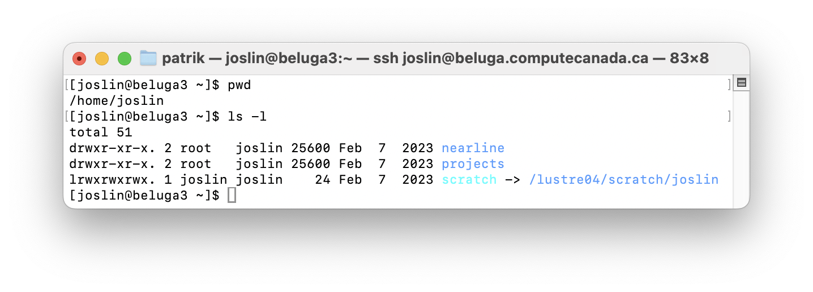
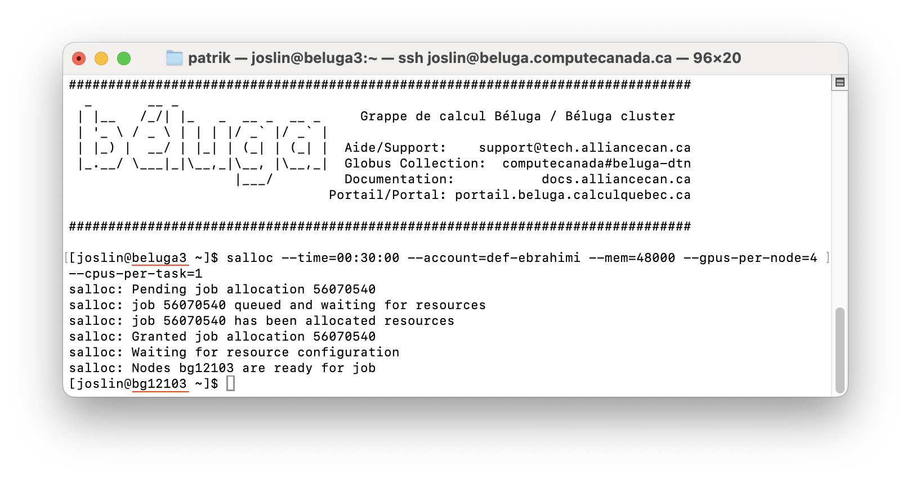

ChatGPT generated image

## Digital Research Alliance of Canada


[Digital Research Alliance of Canada](https://alliancecan.ca/en) is a national research infrastructure that provides high-performance computing resources to researchers across Canada. It is a partnership between the Canadian government and the private sector.


If you don't have an account, you can sign up [here](https://alliancecan.ca/en/register). You will need to get sponsored by your supervisor to get your account approved.


## Login to Compute Canada


Once you have an account, you can login via `ssh` to the cluster. In case you don't have `ssh` installed on your computer, you should follow the instructions [here](https://docs.alliancecan.ca/wiki/doku.php?id=start:ssh) to install it.


Compute Canada has several compute clusters located across Canada. Here is short list of those clusters:


- [Graham]()
- [Cedar]()
- [Narval]()
- [Beluga]()


::: {.callout-tip}
## Cluster Names


The names of the clusters are chosen based some facts about the location of the cluster. For example, `Beluga`,  located at  [École de technologie supérieure](https://www.etsmtl.ca/) in Montreal, is named after the Beluga whale, which is found in the St. Lawrence River.
:::


The name of the cluster is used to login to a specific cluster. For example, to login to the `Beluga` cluster, you can use the following command:


```bash
ssh <your_username>@beluga.alliancecan.ca
```


## Login nodes vs Compute nodes


Unlike other cloud providers, login via `ssh` to a node does not give direct access to a compute machine. Instead, you will be on a `login node` from which you can submit jobs to the `compute nodes`.


### Login nodes
Once you are logged in to the cluster, you will be on a login node. Login nodes are meant for interactive use and are not meant for running your large programs.


Things you can do on the login nodes:


- Git clone your repository
- Run small interactive jobs (will be discussed [below](#interactive-jobs))
- Edit and submit jobs using a text editor
- View the status of your jobs
- Transfer files to and from the cluster
- Create virtual environments and install packages
- Submit jobs to the cluster (will be assigned to a compute node)


Things you cannot do on the login nodes:


- Run large jobs
- Use a lot of memory
- Use a lot of CPU


{.lightbox}


### Compute nodes


Compute nodes are meant for running large jobs. They have more memory and CPU than `login nodes`, and they have GPUs. 

When you submit a job, it is assigned to a compute node with the requested resources. We will get back to this below. Before that, let's discuss file systems and where you should copy the files for your project.


## File System


One of the most important thing to know about Compute Canada is the file system. There are three types of file systems with different properties and limitations: `home`, `project`, `scratch`



Directory structure on Beluga

The `home` directory has small quota, a fixed number of filesystem objects and smaller storage space (generally up to 25 GB) and has dearly backups. The `project` directory is meant for long-term storage of data that is shared across users linked to a sponsor. The `scratch` directory is meant for temporary storage of data and has a larger fixed quota per user and a larger storage space (generally above to 2 PB of space).


::: {.callout-tip}
If you are actively working on a project, I recommend that you copy your data (source code, datasets, etc.) to the `scratch` directory. This will save you time, and you don't need to worry about the storage space. You can copy your data back to the `project` directory after your project is done or paused.
:::


Note that only the unused files on the `scratch` directory are deleted after 30 or 60 days, depending on the cluster. So if you are actively working on your project, you can use scratch and run everything as on your local machine, with logs files and results saved in your project directory. 


A better approach is to have your source code and data in the `project` directory and make sure your logs (e.g., training logs and models' checkpoints) and results are saved in the `scratch` directory. This way you can keep your project directory clean and you can have better control of your data. In another post, we will discuss how to speed up jobs using `$SLURM_TMPDIR`.


## Job Submission


Once you have your data in the `scratch` directory, you can submit a job to the cluster.


### Module loading


Before running any job, you need to load the modules for the software you need. For example, if you need to use `Python 3.10`, you need to load the `Python` module with the following command.


```bash
module load python/3.10
```


After loading the module, you can check if it is loaded correctly by running `module list`. Note that from here on, all the dependencies you install,  with `pip install` for example, will be installed for this specific version of Python and will be available in your environment every time you load the module.


### Virtual environment


After loading the module, you can also create a virtual environment for project-specific dependencies.


```bash
python -m venv .venv
source .venv/bin/activate
```


### Submitting a job


At this point, you should have your data in the `scratch` directory, installed the dependencies in your loaded module and created a virtual environment for project-specific dependencies.


Now you can submit a job to the cluster.


Let's assume you have a Python script (`my_script.py`) that you want to run on the cluster, and you can pass some arguments to it, for example, the number of epochs and the dataset to use, etc. Normally, on your local machine, you run this script as follows:


```bash
python my_script.py --num_epochs 60 --dataset mnist
```


To submit this job to the cluster, you need to create a `job script` that will be used to submit the job. A job script is a bash program that will load the necessary modules and specify the resources your Python program needs (number of nodes, number of cores, amount of memory, type and number of GPUs, etc.).


#### Job script directives


The header of the job script contains directives to specify the resources your Python program needs. Here is an example of a job script header:


```bash
#!/bin/bash
#SBATCH --account=def-someuser
#SBATCH --gpus-per-node=1         # Number of GPU(s) per node
#SBATCH --node=1         # Number of GPU(s) per node
#SBATCH --cpus-per-task=4         # CPU cores/threads
#SBATCH --time=00:15:00           # Time limit in hh:mm:ss 
#SBATCH --mem=1024M
```

- `#SBATCH --account=def-someuser` is the account of your supervisor. To obtain what account you have access to, you can login to [CCDB](https://ccdb.alliancecan.ca/security/login) and click on **My Account -> My Resources and Allocations**


: The illustration above tells you what account you can use on a given cluster. For example, on `Cedar`, I can submit jobs using `#SBATCH --account=def-ebrahimi`.


- `#SBATCH --gpus-per-node=1` is the number of GPUs per node, in general, you set up 4 GPUs per node. And `#SBATCH --node=1` specifies the number of nodes you want to use.
 - If you want to use 2 GPUs per node, you can set `#SBATCH --gpus-per-node=2` and `#SBATCH --node=1`
 - If you want to use 2 nodes with 4 GPUs per node, you can set `#SBATCH --gpus-per-node=4` and `#SBATCH --node=2`, i.e., your job will be using 8 GPUs in total.


- `#SBATCH --cpus-per-task=4` is the number of CPU cores per task. This is the number of CPU cores your program will use.


- `#SBATCH --time=00:15:00` is the time limit for your job. This is the maximum time your job can run.
    In general, you don't know exactly how long your job will run, so you should set a time limit that is long enough to run your job and adjust it later.


- `#SBATCH --mem=1024M` is the amount of memory your job will use. This is the maximum amount of memory your job can use. You can set it in GB as `--mem=32G` you request 32 GB of memory.
   If you are not sure how much memory your job will use, you can set it to a large value and adjust it later.


## Putting it all together


Here is an example of a job script that you can use to submit your job:


```bash
#!/bin/bash
#SBATCH --account=def-ebrahimi
#SBATCH --gpus-per-node=1         # Number of GPU(s) per node
#SBATCH --node=1         # Number of GPU(s) per node
#SBATCH --cpus-per-task=4         # CPU cores/threads
#SBATCH --time=00:15:00           # Time limit in hh:mm:ss 
#SBATCH --mem=1024M


module load python/3.10 # Load the Python module version
source .venv/bin/activate # Activate the virtual environment


python my_script.py --num_epochs 60 --dataset mnist
```


Finally, you can submit your job by running the following command:


```bash
sbatch my_script.sh # You will see a job ID in the output.
```


Depending on the cluster and the resources you requested, your job will be assigned to a compute node and will start running. A log file, named `slurm-<job_id>.out`, will be created in the main directory of your project.


You can check the status of your jobs by running the following command:


```bash
squeue -u <your_username>
```
In case you want to cancel your job, you can run the following command:


```bash
scancel <job_id>
```


If you want to cancel all your jobs, you can run the following command:


```bash
scancel -u <your_username>
```


## Interactive jobs {#interactive-jobs}


Sometimes you want to run a job interactively, for example, to debug your code or to run a small test. You can do this by running the following command:


```bash
salloc --time=00:30:00 --account=def-ebrahimi --mem=48000 --gpus-per-node=4 --cpus-per-task=1
```


Similarly to job scripts, parameters of the `salloc` command specify the resources you need for your interactive job session.


The illustration below shows an interactive job session on the `Beluga` cluster.



Interactive job session on the Beluga cluster


You can see that `salloc` moved us from a login node (`beluga3`) to a compute node (`bg12103`). This compute node has requested resources, i.e., 4 GPUs, 1 CPU core, 48 GB of memory and 30 minutes of time. However, before running your Python program interactively, you need to type commands to load the module and activate the virtual environment.


::: {.callout-tip}
# Interactive jobs


The more you request resources (time, GPUs, CPU cores, memory), the longer you will wait to get an interactive compute node. You can use them to test your code before submitting a job script.
::: 

In the next post, we will discuss how to speed up jobs using `$SLURM_TMPDIR`.


## Conclusion


In this post, we have covered the basics of compute clusters, including how to log in to the cluster, how to submit jobs, and how to use interactive jobs. I believe that from here on, you can navigate the [documentation of the compute cluster](https://docs.alliancecan.ca/wiki/Running_jobs) to learn more options and best practices when using the cluster.


For more training material, you can check these [beginner's guides](https://training.westdri.ca/getting-started/) covering Linux commands, git & version control, and Python programming. 


