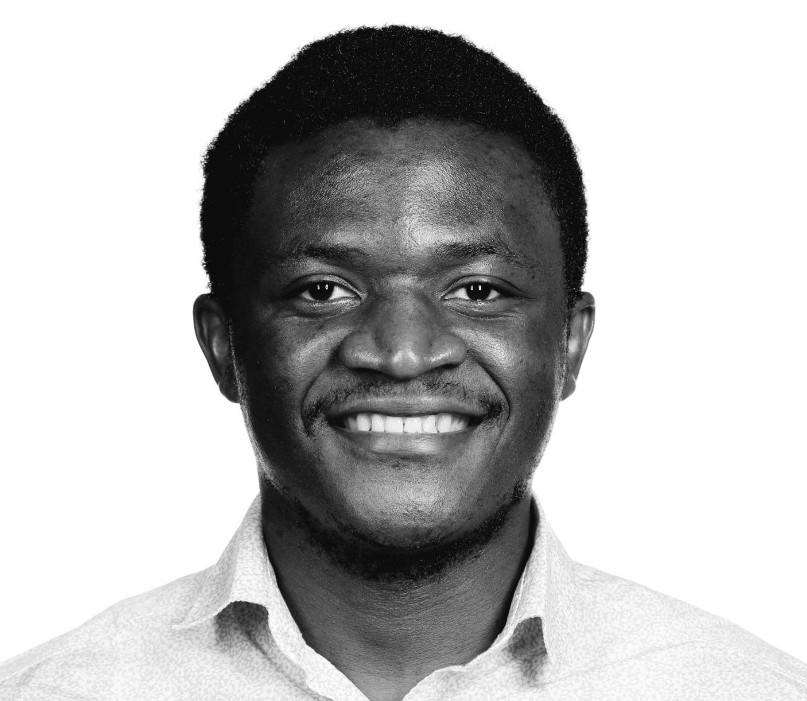

```{=html}
<style>
/* the hero below is this page's title block */
#title-block-header { display: none; }
</style>

<script type="application/ld+json">
{"@context":"http://www.schema.org","@type":"person","name":"Patrik Kenfack","jobTitle":"PhD Candidate","gender":"male","description":"Patrik is a PhD Candidate at Mila working at the intersection of Privacy and Fairness.","url":"https://patrikken.github.io","image":"https://patrikken.github.io/img/me.jpg","birthPlace":"Cameroon","memberOf":[{"@type":"Organization","name":"Mila"},{"@type":"Organization","name":"\u00c9TS Montr\u00e9al"}],"nationality":[{"@type":"Country","name":"Cameroon"}]}
</script>

<div class="hero">
  <div class="hero-photo">
    
  </div>
  <div class="hero-intro">
    <h1 class="hero-name">Hey, I’m Patrik 👋🏿</h1>
    <p class="hero-role">PhD Candidate in Computer Science &middot;
      <a href="https://www.etsmtl.ca/">ÉTS Montréal</a> &amp;
      <a href="https://mila.quebec/">Mila</a></p>
    <div class="hero-links">
      <a class="pub-link" href="https://www.linkedin.com/in/patrik-kenfack-30a8b933/" target="_blank" rel="noopener"><i class="bi bi-linkedin"></i>LinkedIn</a>
      <a class="pub-link" href="https://github.com/patrikken" target="_blank" rel="noopener"><i class="bi bi-github"></i>GitHub</a>
      <a class="pub-link" href="https://scholar.google.com/citations?user=bWvJMcgAAAAJ&amp;hl=fr&amp;oi=ao" target="_blank" rel="noopener"><i class="bi bi-mortarboard"></i>Google Scholar</a>
      <a class="pub-link" href="mailto:kenfackjoslin@gmail.com"><i class="bi bi-envelope"></i>Email</a>
    </div>
  </div>
</div>
```

::: {.bio}
I study **bias mitigation in machine learning under constraints on sensitive
information** — what fairness can mean when you cannot see, or are not allowed to
use, the attributes you would need to measure it. I am advised by
[Ulrich Aïvodji](https://aivodji.github.io/) and
[Samira Ebrahimi Kahou](https://saebrahimi.github.io/).

I recently completed a [Mitacs](https://www.mitacs.ca/) internship at
[Layer6 AI](https://layer6.ai/), where I worked on designing fair tabular
foundation models. Before ÉTS Montréal I was a research assistant at the
[Machine Learning and Knowledge Representation Lab](https://innopolis.university/en/mlkr)
at [Innopolis University](https://innopolis.university/en/), advised by
[Adil Khan](https://www.hull.ac.uk/staff-directory/adil-khan), working on fairness in
ensemble learning, GANs, continual learning and representation learning. I hold an
MSc in Computer Science and a BSc in Mathematics and CS from the
[University of Dschang](https://www.univ-dschang.org/).
:::

```{=html}
<p class="eyebrow">Research interests</p>
<div class="interests">
  <span class="interest">Tabular Foundation Models</span>
  <span class="interest">Algorithmic Fairness</span>
  <span class="interest">Responsible AI</span>
  <span class="interest">Applied Machine Learning</span>
</div>

<h2 class="section-title">News</h2>
```

```{r echo=FALSE}
#| name: setup
#| include: false
#| message: false
#| eval: true
source("helpers.R")
source("paper_utils.R")

# the spreadsheet was fetched once by the generate_papers.R pre-render step
news <- pu_sheet("News")
```

```{r}
#| label: news
#| echo: false
#| results: asis

# minimal markdown -> html (links, bold, italics) for cells written in the sheet
md2html <- function(x) {
    x <- as.character(x)
    x[is.na(x)] <- ""
    x <- gsub("\\[([^]]+)\\]\\(([^)]+)\\)",
        "<a href=\"\\2\">\\1</a>", x,
        perl = TRUE
    )
    x <- gsub("\\*\\*([^*]+)\\*\\*", "<strong>\\1</strong>", x, perl = TRUE)
    x <- gsub("(?<!\\*)\\*([^*]+)\\*(?!\\*)", "<em>\\1</em>", x, perl = TRUE)
    x
}

# "Jun 2026" / "June 2025" -> c("Jun", "2026")
split_date <- function(x) {
    x <- trimws(as.character(x))
    year <- ifelse(grepl("\\d{4}", x), sub(".*?(\\d{4}).*", "\\1", x), "")
    month <- trimws(gsub("\\d{4}", "", x))
    month <- substr(month, 1, 3)
    list(month = month, year = year)
}

# "📄 Paper" -> "paper"  (drives the dot / pill colour in custom.scss)
type_slug <- function(x) {
    s <- tolower(gsub("[^A-Za-z]", "", as.character(x)))
    s[s %in% c("intership", "internship")] <- "internship"
    s[!nzchar(s)] <- "other"
    s
}

# the Type cell may hold several comma-separated tags: "📄 Paper, 🎤 Talk"
split_tags <- function(x) {
    lapply(x, function(cell) {
        if (is.na(cell)) {
            return(character(0))
        }
        tags <- trimws(unlist(strsplit(as.character(cell), ",")))
        tags[nzchar(tags)]
    })
}

d <- split_date(news$Date)
tags <- split_tags(news$Type)

# the first tag decides the timeline dot colour
primary <- vapply(tags, function(t) if (length(t)) type_slug(t[1]) else "other", character(1))

tags_html <- vapply(tags, function(t) {
    if (!length(t)) {
        return("")
    }
    paste0(
        '<div class="news-tags">',
        paste0('<span class="news-tag" data-type="', type_slug(t), '">', t, "</span>",
            collapse = ""
        ),
        "</div>"
    )
}, character(1))

items <- sprintf(
    paste0(
        '<li class="news-item" data-type="%s">',
        '<div class="news-date"><span class="news-month">%s</span>',
        '<span class="news-year">%s</span></div>',
        '<div class="news-body">%s<p class="news-text">%s</p></div></li>'
    ),
    primary,
    d$month,
    d$year,
    tags_html,
    md2html(news$Description)
)

cat('<div class="news-feed"><div class="news-feed__scroll"><ol class="news-list">',
    paste(items, collapse = ""),
    "</ol></div></div>",
    sep = ""
)
```

Happy to talk about research or potential collaborations — reach me on
[LinkedIn](https://www.linkedin.com/in/patrik-kenfack-30a8b933/) or at
[kenfackjoslin@gmail.com](mailto:kenfackjoslin@gmail.com).
